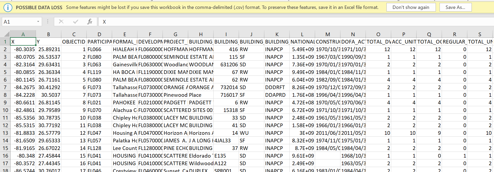
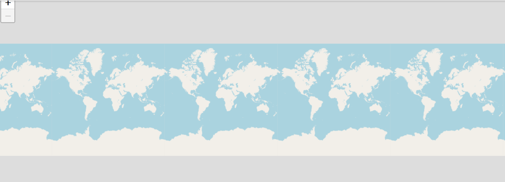
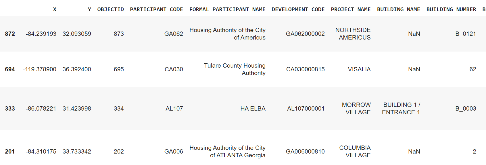

# The Basics of Crafting Static and Interactive Maps with Folium in Python
_Created by Sadie Murray._

## Background 
This tutorial will take you through how to use [Folium](https://python-visualization.github.io/folium/) to create static and interactive maps. Folium uses the mapping capabilities of the `leaflet.js`, a javascript mapping library that is designed with "simplicity, useability and performance" in mind. `Folium` brings the mapping capacity of `leaflet` to python. `Folium` lets you create interactive maps from data that has been manipulated in python, pass raster or vector markers in for use, and lets you bind data to chloropleth maps. The tutorial will take you through uploading and manipulating your data in python and creating customizable interactive maps, including chloropleth maps. 

Before we get started, it's important to mention that `folium` uses the `pandas` dataframe. The `pandas` dataframe is a python library used for mapping. To learn more about Pandas data structures, you can read up it [here](https://pandas.pydata.org/pandas-docs/stable/user_guide/dsintro.html). If you want to learn more about using the `pandas` library, you can follow [this tutorial](https://github.com/comorehouse1620/Matplotlib) before returning to this one. 

### Objectives
The main objective of this lab is to understand how to use the `folium` library, and to gain a deeper understanding of chloropleth maps. 

### What You Need To Begin
1. This tutorial is set up using Google Colabs, so you will need an account 
2. You will need to install [Pandas](https://pandas.pydata.org/), [Folium](https://python-visualization.github.io/folium/), and [JSON](https://docs.python.org/3/library/json.html) libraries
3. You will need to download the data located in this repos "Data" file and data from the site itself

Use the following code to install Pandas, Folium, and JSON libraries: 

```Python
import folium
import pandas as pd
import json
from folium import plugins
```

## Downloading the Data 
Some of the housing data we are going to be using in this tutorial is too big for the repo here, so you're going to need to download the files directly from ArcGIS Online hub that stores the HUD products. 


### Housing Crisis

For this tutorial, we will be using data from the US Department of Housing and Urban Development (HUD) to look at some questions of access to affordable, public housing. Because some of the datasets are quite large, you will need to download them from ArcGIS Online. However, this repo will contain sample datasets that you can download if you would prefer. The steps below will walk you through the datasets you will download and how to upload them into Colab. 

The two datasets we will be downloading are the Estimated Housing Authority Service Area and the Public Housing Buildings datasets. The Estimated Housing Authority Service Area is polygon based data, where the data is aggregated and summarized at the "service areas" created by HUD themselves. The second dataset, Public Housing Buildings, is point based data, with each point representing a public housing building. We will look at how to explore both types of data in this tutorial. 

**The first piece of data you are going to want to download** can be found [here](https://hudgis-hud.opendata.arcgis.com/datasets/HUD::public-housing-buildings/). This is a dataset of all public housing authority buildings and characteristics of these buildings. You should download this data in *csv* format. This is a spreadsheet of all the public housing If you open it up on your computer, it should look something like this:  




**The second piece of data you are going to want to download** can be found [here](https://hudgis-hud.opendata.arcgis.com/datasets/HUD::estimated-housing-authority-service-areas/about). This represents the estimated service areas of housing authorities. You should download this data as a *GeoJSON* file. 

Once you have your data, you're going to want to upload it to Python. You can do that using the code below. Remember to upload all three of the files we are looking at here! 

```Python
# Upload local script to Colab - running this creates a "choose file" button to upload local files.
from google.colab import files
uploaded = files.upload()
```

## Using Folium 

### Basic Maps 
The python code to simply call a genetric folium basemap (and that we will use to add our data or baselayers to eventually) is simple: 

```
folium.Map()
```

And it gives you an output like this: 


Now, if you'd like, you can make all kinds of edits to your map -- changing the zoom, centering the map in a certain area, changing the design of the basemap, or more. The sample code below is just one example of how you can customize even a basic Folium map pretty easily! Here, I've centered the map on Worcester, chosen a relatively close zoom, added a distance scale, and altered the baselayer display from Open Street Maps to Stamen Toner. 

```Python
sample = folium.Map(location=[42.26259, -71.80229], zoom_start=8, control_scale=True, tiles='Stamen Toner')
sample
```
The different types of maps "tiles" you can use are: `Stamen Terrain`, `Open Street Map`, `Stamen Toner`, `Stamen Watercolor`, `CartoDB Positron`, or `CartoDB Dark_Matter`. Play around with these different map formats to find out which ones you like best or which might be most appropriate for your data! 

### Point Maps 
Okay, we're ready to start working with some of our data now! We're going to be using the CSV file "Public_Housing.csv" that we downloaded from HUD at the start of this tutorial. 

Making a marker on Folium is easy! 

```Python
# address latitude and longitude
locate = [42.26259, -71.80229]

# add marker to map
folium.Marker(locate, popup='Home of the Woo Socks!', tooltip='click').add_to(sample)

# display map
sample
```
This is the basic code for displaying a map. We are going to be designing a bit of code that will iterate over our data in order to put down a marker for every public housing building -- but first, we need to load our CVS into google (you might need to reload it, depending on how quickly you have been working through the tutorial -- it's a big file, and can take a while to fully load! 

To set up your data frame, you're going to be using the Pandas library. 

```Python
import csv

#read csv
ph = pd.read_csv('tester.csv')
```

If you'd like to check and see what this looks like, I would recommend running a small bit of code just to look at the first five rows -- like I mentioned, it's a big dataset. 

```Python
ph.sample(5)
```

You'll know you have it right if you get a result that looks something like this: 



To see some more information on what columns we have in here, you can run this code: 

```Python 
ph.info()
```
Okay, now you're ready to convert your CSV data into point data. Here, we're going to add a geometry field to our dataframe, and populate it with the "Point" value containing the latitude and longitude of each Public Housing Building (in our data this is called X and Y, but you'll want to check and see what the column labels are for the lat and long data in other data sets you might upload. 

```Python
#add the geometry field of a point data containing the lat/long value
ph['geometry'] = ph.apply(lambda row: Point(row.X, row.Y), axis=1)

#project the data frame into a coordinate system
ph = gpd.GeoDataFrame(ph, crs={'init' :'epsg:4326'})
```

### Cholorpleth Maps 


### Combining What We Know

Just for a little bit of flare, we're going to now combine our two layers -- our point layer and our chloropleth map. We want to set it up so that you can toggle between both data sets. This is called "layer control". It will be found in the upper right hand corner of your map output (see the red circle below, using the `Stamen Watercolor` map tile). 


The basic code to set up layer control (or layer toggling) is: 

```Python
sample = folium.Map(location=[42.26259, -71.80229], zoom_start=8, control_scale=True, tiles='Stamen Watercolor')

folium.LayerControl().add_to(sample)

sample
```

## Citation 
