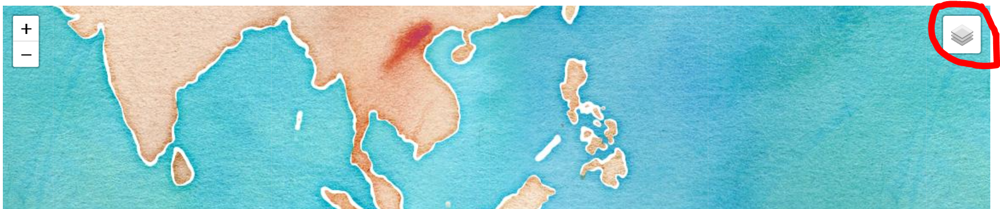

# The Basics of Crafting Static Maps with Panda versus Interactive Maps with Folium in Python
_Created by Sadie Murray._

## Background 
This tutorial has two parts. First, we will walk through how to upload CSV data and create static maps using the Pandas library in Python. Then, I will take you through how to use [Folium](https://python-visualization.github.io/folium/) to create interactive maps. Folium uses the mapping capabilities of the `leaflet.js`, a javascript mapping library that is designed with "simplicity, useability and performance" in mind. `Folium` brings the mapping capacity of `leaflet` to python. `Folium` lets you create interactive maps from data that has been manipulated in python, pass raster or vector markers in for use, and lets you bind data to choropleth maps. The tutorial will take you through uploading and manipulating your data in python and creating customizable interactive maps, including choropleth maps. 

Before we get started, it's important to mention that `folium` uses the `pandas` dataframe. The `pandas` dataframe is a python library used for mapping. To learn more about Pandas data structures, you can read up it [here](https://pandas.pydata.org/pandas-docs/stable/user_guide/dsintro.html), though we will go into greater detail about the Pandas library in that section. If you want to learn more about using the `pandas` library for non-mapping purposes, you can follow [this tutorial](https://github.com/comorehouse1620/Matplotlib) before returning here. 

### Objectives
The main objective of this lab is to understand how to use the `folium` library, and to gain a deeper understanding of choropleth maps. 

### What You Need To Begin
1. This tutorial is set up using Google Colabs, so you will need an account 
2. You will need to install [Pandas](https://pandas.pydata.org/), [Folium](https://python-visualization.github.io/folium/), and [JSON](https://docs.python.org/3/library/json.html) libraries
3. You will need to download the data located in this repos "Data" file 

Use the following code to install Pandas, Folium, and JSON libraries: 

```Python
import folium
import pandas as pd
import json
from folium import plugins
```

## Maps with Pandas  
Some of the housing data we are going to be using in this tutorial is too big for the repo here, so you're going to need to download the files directly from ArcGIS Online hub that stores the HUD products. 


### Housing Crisis

For this tutorial, we will be using data from the US Department of Housing and Urban Development (HUD) to look at some questions of access to affordable, public housing. Because some of the datasets are quite large, you will need to download them from ArcGIS Online. However, this repo will contain sample datasets that you can download if you would prefer. The steps below will walk you through the datasets you will download and how to upload them into Colab. 

The two datasets we will be downloading are the Estimated Housing Authority Service Area and the Public Housing Buildings datasets. The Estimated Housing Authority Service Area is polygon based data, where the data is aggregated and summarized at the "service areas" created by HUD themselves. The second dataset, Public Housing Buildings, is point based data, with each point representing a public housing building. We will look at how to explore both types of data in this tutorial. 

**The first piece of data you are going to want to download** can be found [here](https://hudgis-hud.opendata.arcgis.com/datasets/HUD::public-housing-buildings/). This is a dataset of all public housing authority buildings and characteristics of these buildings. You should download this data in *csv* format. This is a spreadsheet of all the public housing If you open it up on your computer, it should look something like this:  


**A smaller, "sample" version of that data set can be found in the data folder for this tutorial**. Because the data is so large, it might be quicker to use a smaller fraction of the data. It is also helpful if you're having difficulty downloading the data from ArcOnline. Whichever dataset you chose to use should allow you to create and visual point based maps from CSV latitude and longitude files. 

Once you have your data, you're going to want to upload it to Python. You can do that using the code below. Remember to upload all three of the files we are looking at here! 

```Python
# Upload local script to Colab - running this creates a "choose file" button to upload local files.
from google.colab import files
uploaded = files.upload()
```

### Preparing the Data

### Visualizing the Map
Okay, we're ready to start working with some of our data now! We're going to be using the CSV file "Public_Housing.csv" that we downloaded from HUD at the start of this tutorial. 

To set up your data frame, you're going to be using the Pandas library. 

```Python
import csv

#read csv
ph = pd.read_csv('tester.csv')
```

If you'd like to check and see what this looks like, I would recommend running a small bit of code just to look at the first five rows -- like I mentioned, it's a big dataset. 

```Python
ph.sample(5)
```

You'll know you have it right if you get a result that looks something like this: 


To see some more information on what columns we have in here, you can run this code: 

```Python 
ph.info()
```
Okay, now you're ready to convert your CSV data into point data. Here, we're going to add a geometry field to our dataframe, and populate it with the "Point" value containing the latitude and longitude of each Public Housing Building (in our data this is called X and Y, but you'll want to check and see what the column labels are for the lat and long data in other data sets you might upload. 

```Python
#add the geometry field of a point data containing the lat/long value
ph['geometry'] = ph.apply(lambda row: Point(row.X, row.Y), axis=1)

#project the data frame into a coordinate system
ph = gpd.GeoDataFrame(ph, crs={'init' :'epsg:4326'})
```


## Using Folium 
To create visualizations in Folium, we are going to be using data from the [GitHub documentation for the Folium function](https://python-visualization.github.io/folium/index.html). You shouldn't need to download any more data, but the documentation will be a valuable resource moving forward! 

### Basic Maps 
The python code to simply call a genetric folium basemap (and that we will use to add our data or baselayers to eventually) is simple: 

```
folium.Map()
```

And it gives you an output like this: 


Now, if you'd like, you can make all kinds of edits to your map -- changing the zoom, centering the map in a certain area, changing the design of the basemap, or more. The sample code below is just one example of how you can customize even a basic Folium map pretty easily! Here, I've centered the map on Worcester, chosen a relatively close zoom, added a distance scale, and altered the baselayer display from Open Street Maps to Stamen Toner. 

```Python
sample = folium.Map(location=[42.26259, -71.80229], zoom_start=8, control_scale=True, tiles='Stamen Toner')
sample
```
The different types of maps "tiles" you can use are: `Stamen Terrain`, `Open Street Map`, `Stamen Toner`, `Stamen Watercolor`, `CartoDB Positron`, or `CartoDB Dark_Matter`. Play around with these different map formats to find out which ones you like best or which might be most appropriate for your data! 

Making a marker on Folium is easy! 

```Python
# address latitude and longitude
locate = [42.26259, -71.80229]

# add marker to map
folium.Marker(locate, popup='Home of the Woo Socks!', tooltip='click').add_to(sample)

# display map
sample
```

This is the basic code for displaying a map. We are going to be designing a bit of code that will iterate over our data in order to put down a marker for every public housing building -- but first, we need to load our CVS into google (you might need to reload it, depending on how quickly you have been working through the tutorial -- it's a big file, and can take a while to fully load! 

You can use the folium.Icon feature to futher customize your code, using, for example `folium.Icon(color="green")` or `folium.Icon(icon="cloud")`. These will adjust how your markers look! 

You can also do circle markers instead of pin points. For example, 

```Python
#establishes a map of the Worcester Main South region
MainSouth = folium.Map(location=[42.2506, -71.8150], tiles="Stamen Watercolor", zoom_start=11)

#first creates a circle over Hacienda Don Juan, a favorite restaurant of mine
folium.Circle(
    radius=200,
    location=[42.253015371065146, -71.81697934801322],
    popup="Sadie's Favorite Worcester Restaurant",
    color="red",
    fill=False,
).add_to(MainSouth)

#creates a second marker that has a radius that covers most of the Main South region of Worcester at the selected zoom level
folium.CircleMarker(
    location=[42.248117, -71.821894],
    radius=35,
    popup="Main South",
    color="black",
    fill=True,
    fill_color="#3186cc",
).add_to(MainSouth)

#displays the map
MainSouth
```

If you run that code, you'll get a map that looks like this: 


Of course, you can alter the radius, size, location, color and more of your markers in order to customize your map! 

Finally, you can customize your code by making it so that users can interact with your map, placing their own marker by clicking on it. 

```Python
#establishes a map to display the terrain of Mount Wachusetts
MtW = folium.Map(location=[42.489930915979066, -71.88691379690194], tiles="Stamen Terrain", zoom_start=13)

#add interactive lat/long element
MtW.add_child(folium.LatLngPopup())

#display map 
MtW
``` 

That will look a little something like this, depending on where you click on your map: 


These markers will just include the lat and long values where you click. If you would like to add the data as a marker, or series of markers on your map, you can use `m.add_child(folium.ClickForMarker()` syntax -- including in the double paranthesis what, if any, dialogue option you want to pop up when the markers themselves are clicked. There are, of course, even more ways that you can use to personalize, customize and create your markers. We won't be covering them in this tutorial, but you can use [vincent](https://github.com/wrobstory/vincent) or [altair](https://altair-viz.github.io/) if you'd like more information! 

Here's one example of using the `folium.ClickForMarker()` code: 

```Python 
#establishes a map to display the terrain of Mount Wachusetts
MtW = folium.Map(location=[42.489930915979066, -71.88691379690194], tiles="Stamen Terrain", zoom_start=13)

#add interactive lat/long element
MtW.add_child(folium.ClickForMarker(popup="Waypoint"))

#display map 
MtW
```
That version, with the handful of waypoints I've added by clicking on my own map, would display a version of Mount Wachusetts like this (instead of with one point displaying lat/long like the first example code): 


You'll be able to add as many markers as you need. 

### Cholorpleth Maps 

Now, this part is pretty simple. We're going to be initializing a choropleth map, but we're going to be doing it by first importing a json of the US states and then attaching a CSV. All the data here comes from the Python documentation page for the Folium library, so you shouldn't need to download anymore data -- though you are welcome to use your own datasets for these step instead! 

```Python
import pandas as pd

url = (
    "https://raw.githubusercontent.com/python-visualization/folium/master/examples/data"
)
state_geo = f"{url}/us-states.json"
state_unemployment = f"{url}/US_Unemployment_Oct2012.csv"
state_data = pd.read_csv(state_unemployment)

m = folium.Map(location=[48, -102], zoom_start=3)

folium.Choropleth(
    geo_data=state_geo,
    name="choropleth",
    data=state_data,
    columns=["State", "Unemployment"],
    key_on="feature.id",
    fill_color="YlGn",
    fill_opacity=0.7,
    line_opacity=0.2,
    legend_name="Unemployment Rate (%)",
).add_to(m)

folium.LayerControl().add_to(m)

m

```

The intial choropleth map that we are able to create here should look something like this: 


Now that we have our choropleth map, we're going to want to edit the actual content of the data. First, we can use different functions to re-bin our data! This is critical if you want to use different breaks, control the number or location of the breaks, or otherwise alter the default data stratification done by Python. In this example, you're just going to be re-binning the data, which should give you a slightly different map! 

```Python
bins = list(state_data["Unemployment"].quantile([0, 0.25, 0.5, 0.75, 1]))

m = folium.Map(location=[48, -102], zoom_start=3)

folium.Choropleth(
    geo_data=state_geo,
    data=state_data,
    columns=["State", "Unemployment"],
    key_on="feature.id",
    fill_color="YlGn",
    fill_opacity=0.7,
    line_opacity=0.2,
    legend_name="Unemployment Rate (%)",
    bins=bins,
    reset=True,
).add_to(m)

m
```


As you can see, the data has been divided into six different bins. You can run different variations of this code, by using `bins=4` or any number of bins, or by creating your own binning categories in the `folium.Choropleth()` syntax. Altering the line `bins=bins,` to read `bins=[0,20,60,100],` for example, is one method you could use to alter your bin categories. This can be a critical decision to make, and it is often helpful to explore a variety of different bins -- or even use histograms of your data -- to select the proper bin to tell the story of your data. 

### Adding Flare

Once you've got your data organized on the map the way you want it organized, you can customize the map aesthetics! 

```Python
#imports the branca styling library 
import branca

#gets the url of data from github
url = (
    "https://raw.githubusercontent.com/python-visualization/folium/master/examples/data"
)
county_data = f"{url}/us_county_data.csv"
county_geo = f"{url}/us_counties_20m_topo.json"

#reads through the country CSV, establishing a space for n/a or null values 
df = pd.read_csv(county_data, na_values=[" "])

#creates the color scale for the man -- I've chosen a purple to red color scale here. 
colorscale = branca.colormap.linear.PuRd_09.scale(0, 100000)

#creates the data frame for our data
employed_series = df.set_index("FIPS_Code")["Employed_2011"]

#creates a function designed to color each of the stateas based on our data
def style_function(feature):
    employed = employed_series.get(int(feature["id"][-5:]), None) 
    return {
        "fillOpacity": 0.7,
        "weight": 0.2,
        "fillColor": "#gray" if employed is None else colorscale(employed), 
    }

#intializes our folium map
unemployment = folium.Map(location=[48, -102], tiles="cartodbpositron", zoom_start=3)

#loads our json topography (country data)
folium.TopoJson(
    json.loads(requests.get(county_geo).text),
    "objects.us_counties_20m",
    style_function=style_function,
).add_to(unemployment)

#displays map
unemployment
```


Just for a little bit of flare, we're going to now combine our two layers -- our point layer and our choropleth map. We want to set it up so that you can toggle between both data sets. This is called "layer control". It will be found in the upper right hand corner of your map output (see the red circle below, using the `Stamen Watercolor` map tile). You can use this to toggle between a point based layer, a choropleth map, or multiple different polygon based maps -- for example, if you wanted to filter through maps for housing access by year. It'll give us an output that looks something like this: 



The basic code to set up layer control (or layer toggling) is: 

```Python
#set up a basic sample map
sample = folium.Map(location=[42.26259, -71.80229], zoom_start=8, control_scale=True, tiles='Stamen Watercolor')

#add the layer control toggle to the map
folium.LayerControl().add_to(sample)

#display the map 
sample
```

Additionally, to play around with how to make your maps look as interesting, unique or detailed as possible, you can visit the [library of folium functions](https://python-visualization.github.io/folium/modules.html) to understand the syntax involved. Happy coding! 

## Citation 
I'd like to thank my professor, Shadrock Roberts! 
